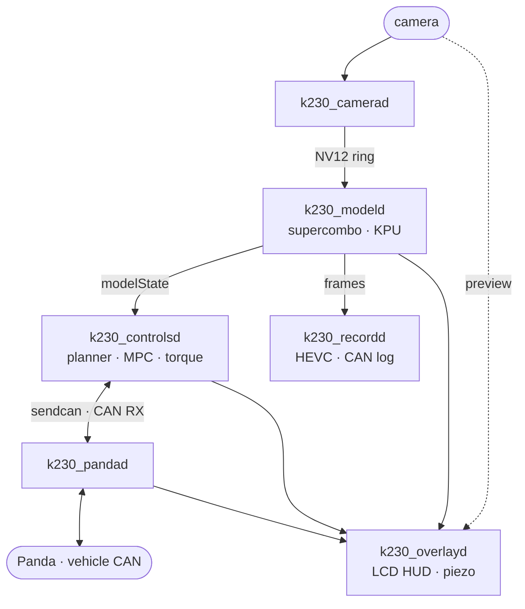

# K230 × openpilot

<p align="center">
  
</p>

<p align="center">
  <strong>openpilot perception and lateral control, native on a Kendryte K230</strong><br>
  KIA K7 YG HEV · supercombo on the KPU · Panda USB/CAN · 800x480 driving HUD
</p>

| Board | Vehicle | Model | Control | Runtime |
| --- | --- | --- | --- | --- |
| 01Studio CanMV K230 | KIA K7 YG HEV | openpilot v0.9.4 supercombo | lateral (LKAS torque) | C++17 split processes |

> [!WARNING]
> This is experimental vehicle-control software. Keep Panda safety enabled, run
> in shadow mode first, and validate every change in a controlled environment
> before road use.

## Highlights

- **supercombo on the KPU.** openpilot v0.9.4 compiled with nncase (int16
  activations, pre-quantized uint8 weights) runs in 27.7 ms per frame, inside
  the 20 Hz budget. Both image towers are fed from one camera, and the
  calibrated input warp runs on the VGLite GPU.
- **openpilot's lateral stack in C++.** Lane planner, lateral MPC, torque
  controller, and online camera calibration, with no openpilot checkout, Python
  native extension, or Qt on the board. The in-tree MPC solver replaces acados
  and is about 30x faster on the board. Ports of paramsd and torqued estimate
  the steer ratio and torque response while driving (opt-in).
- **K7 YG HEV integration.** `LKAS11` and `MDPS12` at 100 Hz, `CLU11` at 50 Hz,
  the 60 kph MDPS speed helper, and a torque ramp that cuts the request before
  the MDPS fault angle.
- **Vision cruise.** The vision lead nudges the stock fixed-speed cruise setpoint
  with `SET-`/`RES+` pulses. There is no longitudinal actuation.
- **Driving HUD.** Plan, lanes, road edges, and lead over the camera preview on
  the 800x480 LCD, status panels, piezo tones, and stop-and-go departure alerts.
- **Record, replay, tune.** HEVC video and the CAN log in 60 s segments, host
  tools that replay a drive open- or closed-loop, and a web parameter editor
  whose changes the controller picks up within 100 ms.
- **Tested off the board.** The control and perception libraries build on
  macOS or Linux, with a googletest suite that needs neither the board nor the
  K230 toolchain.

## Architecture



Each process does one job and talks to the others through `/dev/shm`, keeping
openpilot's process boundaries without Cap'n Proto/cereal. `k230_manager.py`
starts and supervises them, and `k230_param_server.py` serves the tuning UI. See
[Split runtime](docs/runtime.md) for each process.

## Safety model

Every layer must agree before steering torque reaches the car:

1. **Panda safety firmware** (`hyundaiCommunity`) enforces the Hyundai torque,
   rate, and driver-override limits and is never bypassed.
2. **`k230_controlsd` gates** require a fresh model, a valid MPC solution, fresh
   vehicle state, the right gear, a fastened seatbelt, and an explicit driver
   SET press. A failing gate shows its reason on the HUD.
3. **Controller limits** cap the curvature at openpilot's `0.2 1/m` with a jerk
   limit, rate-limit the torque, and ramp it to zero before the MDPS fault angle.
4. **`K230_PANDA_TX`** is the final transmit switch; the controller never
   transmits on its own.

## Hardware

- 01Studio CanMV K230 with its camera and 3.5-inch 800x480 LCD, flashed with the
  [CanMV-K230 Linux v1.2 image](https://github.com/cwal1220/k230_linux_sdk/releases/tag/v1.2-01studio-20260907.1)
  (camera and display stack, nncase v2.11.0 runtime, `S35supercombo_k230`
  service)
- a comma Panda on USB
- a KIA K7 YG HEV
- optional: the printable [windshield mount](docs/hardware/windshield_mount/README.md)

## Getting started

1. **Prepare the board.** Flash the image above and install the packages in
   [Board setup](docs/board-setup.md).
2. **Build and upload.** Cross-build on macOS
   ([setup](docs/build-and-deploy.md#macos-cross-build)) and upload:

   ```sh
   ./scripts/fetch_nncase_runtime.sh
   ./scripts/configure_k230_macos.sh
   make -C build -j2
   scripts/upload_to_board.sh root@<board-ip>
   ```

   Or build natively on the board:

   ```sh
   cd /root/supercombo_k230
   ./scripts/fetch_nncase_runtime.sh
   cmake -S . -B build-native -DCMAKE_BUILD_TYPE=Release
   cmake --build build-native -j2
   cmake --install build-native --prefix /root/supercombo_k230
   ```

3. **Run.** The image's `S35supercombo_k230` service starts `k230_manager.py` at
   boot; `/etc/init.d/S35supercombo_k230 restart` restarts it. Tune parameters at
   `http://<board-ip>:8080`.
4. **Shadow run first.** Verify Panda RX, safety mode, and counters with TX off
   before enabling it; the gates are listed in
   [K7 Panda port](docs/k7-panda-port.md).

## Development

```sh
./scripts/run_host_tests.sh    # build and run every host unit test through ctest
```

- [Host unit tests](gtest/README.md): what each test covers and how to add one
- [Diagnostic tools](diagnostics/README.md): replay, dataset, and benchmark tools
- [Closed-loop replay](docs/closed-loop-replay.md): rank control changes against
  a recorded drive before driving them
- [Scripts](scripts/README.md): build, deploy, and the board-side Python

## Repository layout

```text
src/          runtime processes and their libraries
params/       runtime parameters, hot-reloaded by the processes
models/       supercombo.kmodel, PTQ calibration data, verification records
gtest/        host unit tests
diagnostics/  replay, dataset, and benchmark tools
scripts/      build and deploy scripts, board-side Python
tools/        model pipeline, route readers, HUD tools
assets/       UI sprites installed next to the binaries
include/      K230 SDK headers
docs/         documentation
```

## Documentation

- **Setup:** [Board setup](docs/board-setup.md) · [Build and deploy](docs/build-and-deploy.md) ·
  [Windshield mount](docs/hardware/windshield_mount/README.md)
- **How it works:** [Split runtime](docs/runtime.md) · [Model pipeline](docs/model-pipeline.md) ·
  [Model package](models/README.md) · [Source layout](docs/source-layout.md)
- **Operating:** [Runtime options](docs/runtime-options.md) · [Parameters](params/README.md) ·
  [Diagnostics](docs/diagnostics.md) · [Verification](docs/verification.md)
- **Design notes:** [K7 Panda port](docs/k7-panda-port.md) · [Departure alerts](docs/departure-alerts.md) ·
  [Closed-loop replay](docs/closed-loop-replay.md)

## Acknowledgements

- [openpilot](https://github.com/commaai/openpilot) by comma.ai: the supercombo
  model, and the planner, MPC, calibration, and parameter estimators this
  runtime ports
- [panda](https://github.com/commaai/panda): the CAN interface and its safety
  firmware
- [nncase](https://github.com/kendryte/nncase) by Kendryte: the KPU compiler and
  runtime
