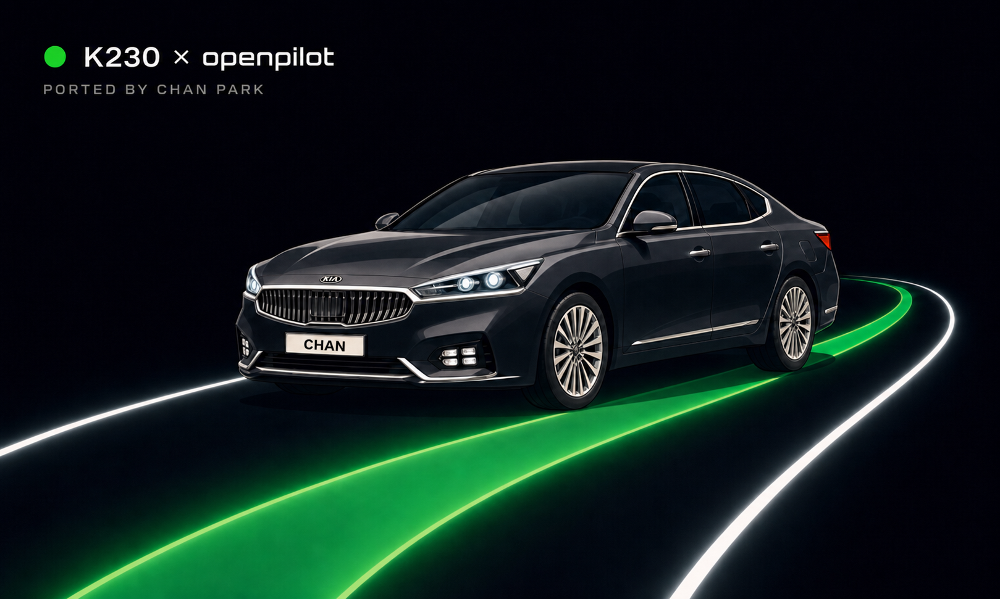

# K230 x openpilot

<p align="center">
  
</p>

<p align="center">
  <strong>Native openpilot perception and lateral control on Kendryte K230</strong><br>
  KIA K7 YG HEV · dual-camera model input · Panda USB/CAN · 800x480 driving HUD
</p>

| Target | Vehicle | Model | Runtime |
| --- | --- | --- | --- |
| Kendryte K230 / 01Studio | KIA K7 YG HEV | openpilot supercombo | C++ split pipeline |

> [!WARNING]
> This is experimental vehicle-control software. Keep Panda safety enabled and
> validate changes in a controlled environment before road use.

## Overview

This repository runs the openpilot `supercombo` model natively on a Kendryte
K230 and drives the lateral control of a KIA K7 YG HEV through a Panda USB/CAN
bridge. There is no openpilot checkout, Python native extension, or Qt
dependency on the board.

The runtime is split into small single-purpose processes that communicate
through `/dev/shm`, mirroring openpilot's process boundaries without the cost of
Cap'n Proto/cereal:

```
k230_camerad ──► k230_modeld ──► k230_controlsd ──► k230_pandad ──► vehicle CAN
                      │                 │
                      └────► k230_overlayd (HUD)   k230_recordd (logging)
```

Perception comes from the supercombo model. Lateral planning uses the
openpilot lane planner with a generated Acados MPC, and the K7 torque controller
packs `LKAS11`/`CLU11`/`MDPS12` at 100 Hz. Longitudinal control is not
implemented: the vision lead is used only to nudge the car's stock fixed-speed
cruise setpoint through simulated button presses.

### Model artifact

- `models/supercombo.kmodel`

The kmodel is compiled from the upstream openpilot v0.9.4 release:

- [supercombo.onnx](https://github.com/commaai/openpilot/blob/v0.9.4/selfdrive/modeld/models/supercombo.onnx)

`scripts/build_supercombo_model.sh` fetches it and runs the whole pipeline. The
intermediate ONNX files are generated artifacts and are intentionally not
tracked here; see `tools/model/` for the scripts and `models/README.md` for the
input contract and board verification numbers.

## Quick start

```sh
# on the board, after the packages in docs/board-setup.md are installed
cd /root/supercombo_k230
./scripts/fetch_nncase_runtime.sh
cmake -S . -B build-native -DCMAKE_BUILD_TYPE=Release -DSUPERCOMBO_BUILD_PANDA=ON
cmake --build build-native -j2
cmake --install build-native --prefix /root/supercombo_k230
./k230_manager.py
```

## Documentation

### Getting started

- [Board setup](docs/board-setup.md) — packages, required image contents
- [Build and deploy](docs/build-and-deploy.md) — native, cross-build, upload
- [macOS build environment](docs/macos-build-environment.md) — Homebrew host setup
- [Windshield mount](docs/hardware/windshield_mount/README.md) — printable K230 + LCD bridge

### How it works

- [Split runtime](docs/runtime.md) — managed startup and each process
- [Model pipeline](docs/model-pipeline.md) — capture, input warp, model output layout
- [Source layout](docs/source-layout.md) — what lives where

### Operating

- [Runtime options](docs/runtime-options.md) — environment variables, parameter editor, defaults
- [Verification](docs/verification.md) — calibration equivalence and host self-tests
- [Diagnostics](docs/diagnostics.md) — benchmarks, NV12 replay, recording format
- [Recovery](docs/recovery.md) — board recovery procedures

### Design notes

- [CAN stability plan](docs/can_stability_plan.md)
- [Departure alerts](docs/departure_alerts.md)
- [YG panda port](docs/yg_panda_port.md)

## Safety model

Three independent layers must all agree before any steering torque reaches the
car:

1. **Panda safety firmware** enforces Hyundai torque, rate, and driver-override
   limits and is never bypassed.
2. **`k230_controlsd` gates** require a fresh model, a valid MPC solution, fresh
   vehicle state, correct gear, and an explicit driver SET press. Any failing
   gate reports a named block reason on the HUD.
3. **`K230_PANDA_TX`** is the final transmit switch; the controller never
   transmits on its own.
