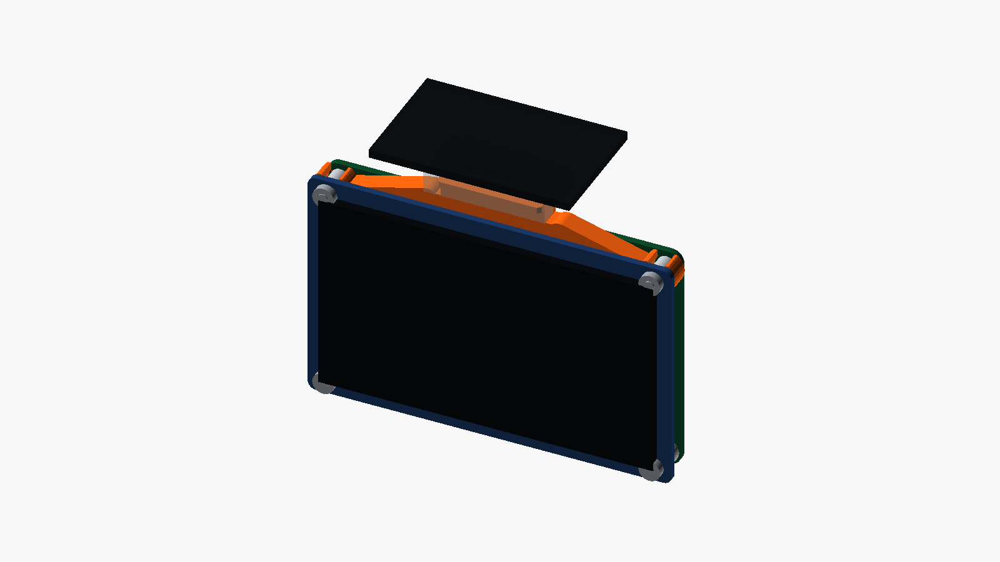
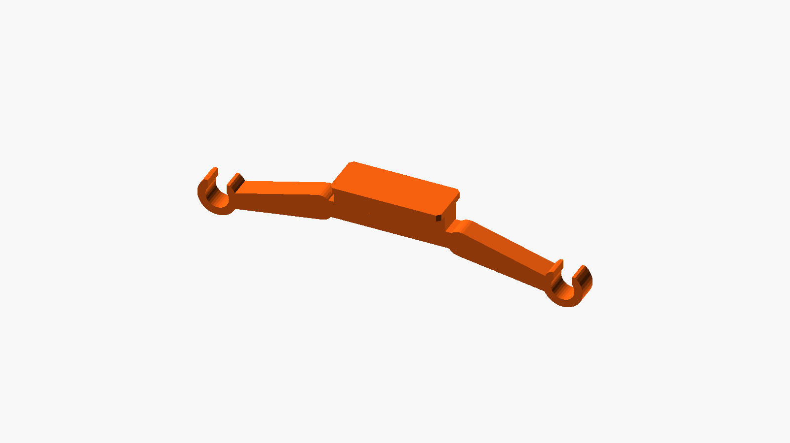

# Windshield mount — CanMV K230 + LCD male-plate bridge

A minimal printed bridge that clamps onto the two upper standoffs between the
01Studio CanMV K230 and its 3.5-inch LCD, and carries a **male plate** on top
that slides into the recessed channel of an iNavi windshield cradle.

Target cradle: the adjustable-angle iNavi mount shared by the A700, Z500,
Z3000, QXD7000, QXD8000, and Z8000.

  
  

The iNavi cradle is the female side and this part is the male side. In the
vehicle the PCB stands vertically and the male plate lies horizontally on top
of it like a shelf. The 25 mm dimension runs left-right (X), the 10.5 mm
dimension runs front-back (Z), and the 1.5 mm thickness runs up-down (Y), so
the wide 25 x 10.5 mm face points up (+Y).

The plate stays centered. Only the neck cross-section is rotated 90 degrees, so
its 25 mm dimension follows the left-right slide axis (X) and its 5.5 mm
dimension becomes the guide width (Z). The neck therefore travels along the
central vertical slot of the female channel, and the plate can be slid in from
either side.

## Measured dimensions

| Item | Value |
|---|---:|
| Male plate width (X) | 25.0 mm |
| Male plate depth (Z) | 10.5 mm |
| Male plate thickness (Y) | 1.5 mm |
| LCD standoff outer diameter | 4.4 mm |
| Neck length along slide axis (X) | 25.0 mm, same as plate |
| Neck guide width (Z) | 5.5 mm |
| Neck height (Y) | 4.0 mm |
| K230–LCD PCB gap | 5.5 mm, measured |
| Standoff center-to-center spacing | 78.0 mm |
| Overall width | 87.0 mm |
| C-clip outer diameter | 9.0 mm |
| C-clip inner pocket | 5.3 mm |
| C-clip mouth | 4.2 mm |
| C-clip and brace arm height | 4.9 mm |
| Board top to plate top face | 8.5 mm |
| Center root W x L x H | 31.5 x 4.0 x 4.9 mm |

All four plate corners carry a 0.6 mm chamfer only; the maximum outer
dimensions are preserved.

## Structure

- The two silver standoffs fixed to the LCD are not removed
- Two 9.0 mm outer-diameter C-clips wrap the 4.4 mm cylinders
- A 5.3 mm inner pocket and 4.2 mm mouth absorb print tolerance while keeping
  the snap fit
- Clip and brace arms share the same height and clear both PCB faces by 0.3 mm
- A full-height center root ties the left and right arms together
- The root connects to a narrow vertical neck at the rear
- The 25 x 10.5 x 1.5 mm male plate stays centered
- The neck matches the plate at 25 mm along the slide axis, 5.5 mm wide
- Total protrusion from board top to plate top face is 8.5 mm
- No bumper or frame wraps the board or LCD perimeter

## Files

- `centered_plate_neck.stl` — printable part
- `centered_plate_neck.png` — part render
- `centered_plate_neck_full.png` — render of the bridge mounted between the
  K230 and its LCD

## Simplification for low-end printers

The C-clips are the tolerance-sensitive feature, so they were simplified and
reinforced:

- C-clip outer diameter 9.0 mm
- 0.45 mm radial clearance around the 4.4 mm standoff
- C-clip mouth 4.2 mm
- 32 arc segments
- 6.0 mm reinforcement width at the arm ends
- 0.8 mm plate chamfer

This revision is less sensitive to extrusion variation and axis play, and is
easier to press onto the standoffs.

## Remaining dimension to confirm

The three plate dimensions, the standoff outer diameter, and the 5.5 mm gap
between the two PCBs are already applied. Only one item still needs a physical
check:

- The exact width of the central guide slot in the female channel

The neck guide width is currently 5.5 mm. If the measured slot is narrower,
reduce `MALE_NECK_SLOT_T`.

## Pre-print checks

1. Confirm the left-right standoff center spacing is 78.0 mm.
2. Confirm the standoff outer diameter is 4.4 mm.
3. Confirm the facing surfaces of the two PCBs are 5.5 mm apart.
4. Confirm the plate that enters the iNavi channel is 25.0 x 10.5 x 1.5 mm.
5. Confirm the central guide slot accepts the 5.5 mm neck.

## Assembly

1. Remove the two upper screws from the K230 and gently separate the board from
   the LCD.
2. Leave the silver standoffs attached to the LCD.
3. Align both C-clips over the two silver cylinders and press them on together.
4. Return the K230 to position and refit the original M2.5 screws.
5. Slide the horizontal male plate sideways into the recessed iNavi channel.
   The thin neck travels along the central guide slot.
6. Confirm the plate does not rock.
7. Attach a separate safety tether and run a pull test in every direction
   before mounting in the vehicle.

## Print recommendations

- First dimensional prototype: PETG
- Final in-vehicle part: ASA, PC, or PA-CF
- Do not use PLA
- 0.4 mm nozzle, 0.15–0.20 mm layers
- 5 or more perimeters, 6 top and bottom layers, 60% or more infill
- Print with the wide plate face parallel to the bed so the 25 mm direction
  does not fail between layers
- Check the 1.5 mm plate and the neck for stress whitening and cracking through
  repeated attach/detach cycles

> [!WARNING]
> This is a load-bearing part above the driver. Use a separate safety tether and
> verify retention before any road use.
